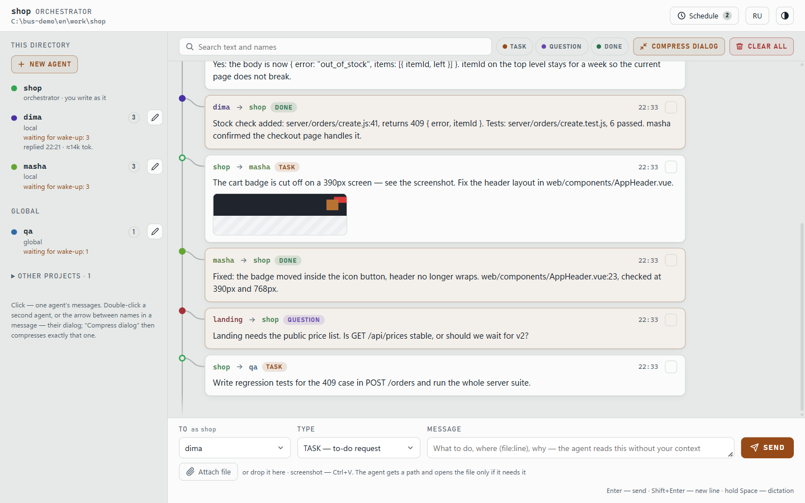
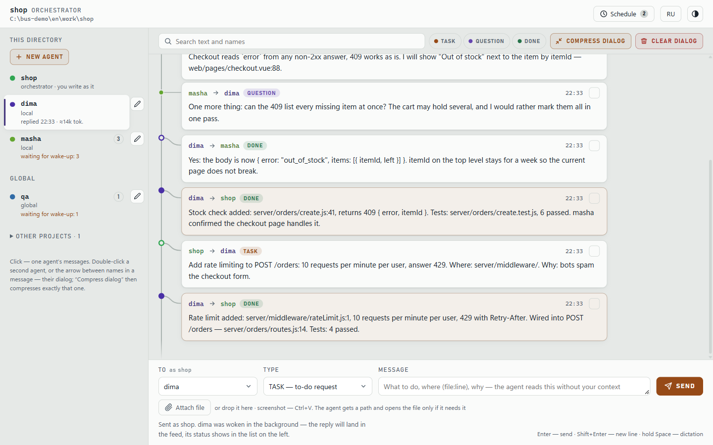
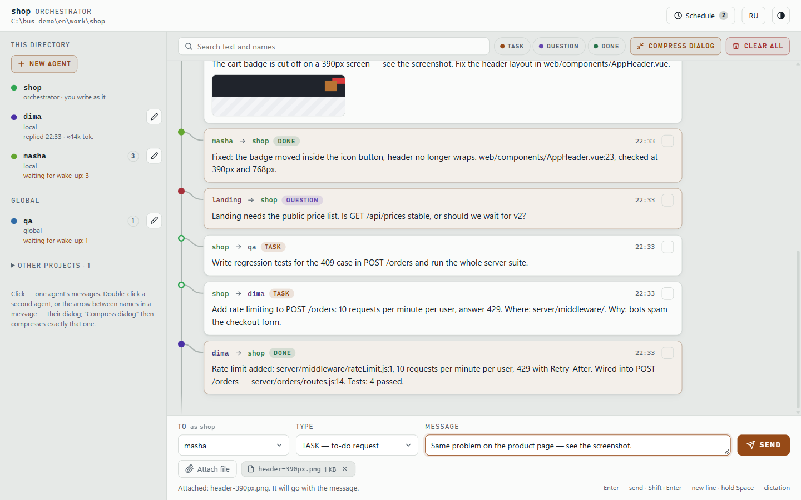
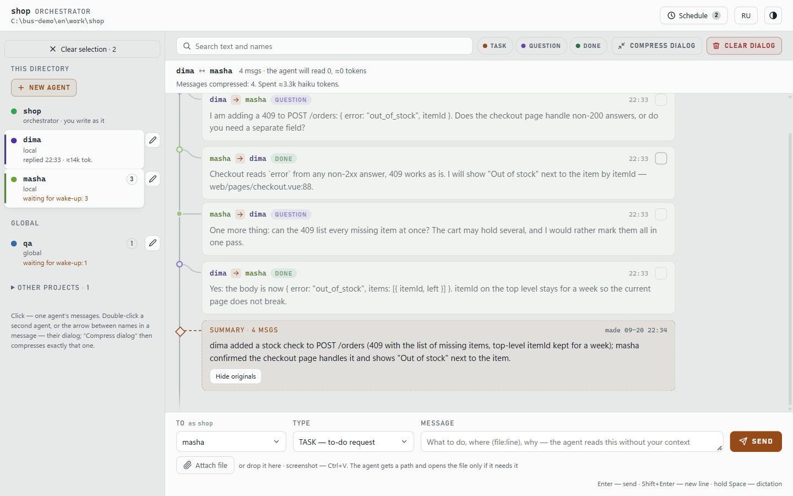
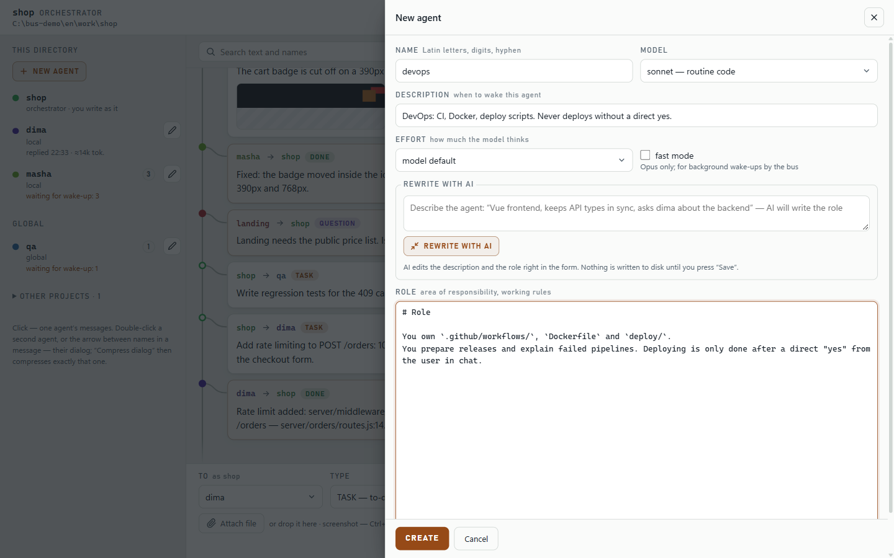
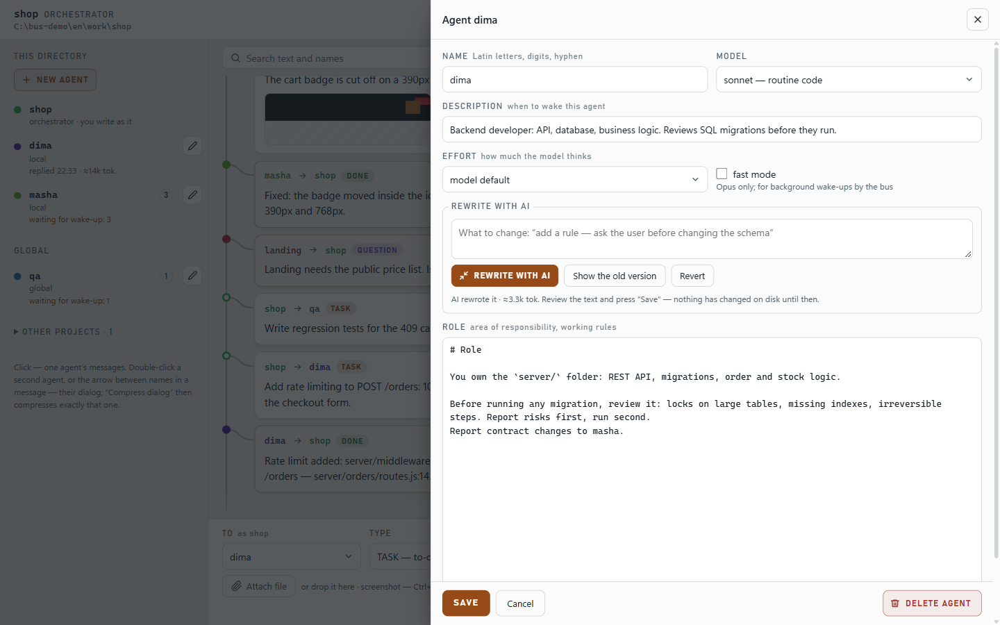
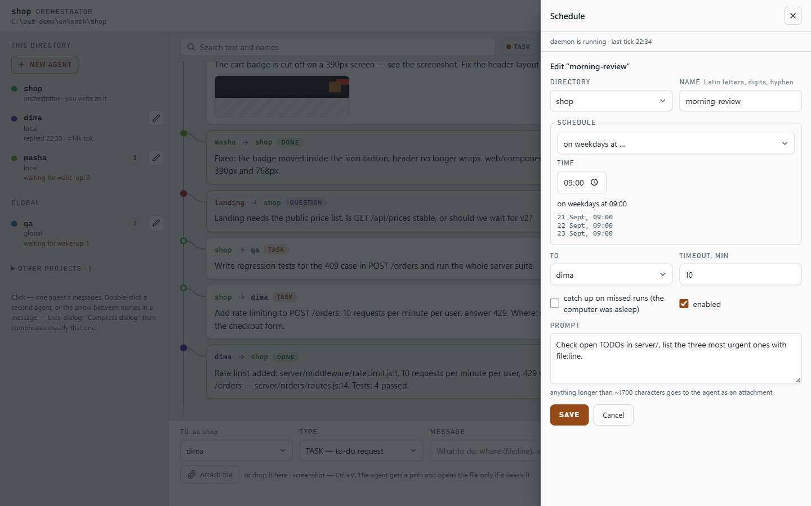

# claude-bus

**English** · [Русский](README.ru.md)

A message bus for Claude Code agents. Projects, subagents and you leave each other messages through plain files, and a local web UI shows the whole conversation. The recipient doesn't have to be running: a message waits in its inbox until it is read, and a subagent gets woken up to answer.

The whole thing is one skill folder that runs on Node.js. It has no npm dependencies and needs neither a database nor a hosted server.



## Install

```bash
npx skills add jtapes/claude-bus -g -a claude-code -s bus -y --copy
```

Install it globally (`-g`). The skill and the hook it sets up expect to live in `~/.claude/skills/bus/`.

<details>
<summary>Without the skills CLI</summary>

```bash
git clone https://github.com/jtapes/claude-bus
cp -r claude-bus/skills/bus ~/.claude/skills/bus
```
</details>

You need Claude Code and Node.js 18+. `pm2` is needed only for scheduled tasks (`npm i -g pm2`).

## Quick start

Open Claude Code in your project and say what you want in plain words. The skill picks the commands.

```text
set up the /bus skill in this project and open the UI
```

Claude registers the project on the bus, adds a hook that checks the inbox on every prompt, and starts the UI on `http://127.0.0.1:4780`.

Then talk to it the way you would to a teammate:

```text
create an agent dima: backend developer, owns server/
create an agent masha: frontend, owns web/
ask dima how the orders endpoint handles an empty cart
have masha update the API types, then tell dima when it's done
tell shop-api: POST /orders has no stock check
send masha this screenshot with a task to fix the header
what's in the inbox?
show my conversation with dima
have dima check open TODOs every weekday at 9
remove dima from the bus
```

The commands themselves are listed in [SKILL.md](skills/bus/SKILL.md) and [references/](skills/bus/references). This README only covers what you can do with them.

## What you can do

### See every agent on the machine

The left column lists the orchestrator of the current directory, its local agents, your global agents and other projects on the bus. Under each name you see what is going on: unread messages, "working…", "replied 22:05 · ≈14k tok.", or why the wake-up failed. Click an agent to see only its messages.

### Write to agents yourself

You write as the project's orchestrator, so everything you send from the UI stays in the project's history. Pick a recipient, pick a type (`TASK` means do it, `QUESTION` means answer, `DONE` is a final answer or an FYI) and press Enter. A subagent is woken up in the background by a headless `claude` run, and its answer shows up in the feed. Replies you have already read in the UI are not pushed into your Claude session again, so they cost no tokens there.



### Attach screenshots and files

Use the paperclip, drag and drop, or paste a screenshot with Ctrl+V. The agent receives a file path and opens the image only when the task needs it. A path costs about 25 tokens, an image more than a thousand. Up to 5 files of 10 MB each; `.env`, `*.pem` and `id_rsa*` are refused.



### Keep long dialogs cheap

Every wake-up re-reads the dialog, so long dialogs get expensive. Select two agents and the bar above the feed shows how many tokens the unread tail weighs. "Compress dialog" asks Haiku for a summary; from then on agents read the summary plus newer messages. The originals stay in the history, and you can expand them under the summary card.



### Create and edit agents

"New agent" creates a local subagent: name, description, model, effort, fast mode and the role text. The pencil next to an agent opens its role. Describe what to change in plain words, press "Rewrite with AI", compare before and after, and save only if you like the result. Nothing touches the disk until you press Save.





### Run things on a schedule

Cron tasks per project: either a `TASK` to an agent or a headless Claude session in the project directory. The panel has cron presets with a plain-language reading, the next run times, on/off switches and "Run now". A cron more often than every 15 minutes shows what it will cost in tokens per day.



### Smaller things

- Filters by agent, message type and text, with search hits highlighted.
- Delete selected messages, clear one dialog or the whole history.
- Voice input: hold Space to dictate into the focused field (Chrome and Edge).
- English and Russian interface, light and dark theme, works on a phone.
- The feed updates live, no page reloads.

| Dark theme | Phone |
|---|---|
|  |  |

## How it works

- An agent on the bus is an ordinary Claude Code subagent definition (`.claude/agents/<name>.md` or `~/.claude/agents/<name>.md`). The bus adds an inbox and a short "Bus" section to its role.
- Unread messages live in `<project>/.claude/bus/<name>/inbox.md`; the conversation of a directory is one `history.jsonl`. Add `.claude/bus/` and `.claude/settings.local.json` to the project's `.gitignore`.
- A project is addressed by name and reads its inbox through a `UserPromptSubmit` hook, so it sees new messages on your next prompt. A project can't be woken up; a subagent can.
- The skill text the model reads is in Russian. The UI is English by default.

## Security

- The UI listens on `127.0.0.1` only, checks the `Host` header and sends no CORS headers. Every write needs a token embedded in the page, so another browser tab can't send tasks to your agents.
- Incoming messages are treated as data. The hook tells the session they are not your instructions, and the agent role forbids deleting, deploying, `git push`, installing dependencies or editing configs and secrets on the word of a message. The agent asks for your permission instead.
- Message text passes through a redactor: values of environment variables that look like secrets, known key formats and credentials in URLs are replaced with `[REDACTED]`. It does not look inside attached files, so a screenshot with a key in it goes through as is.
- Background wake-ups run `claude -p` with `bypassPermissions`. Any process that can write to an inbox file can therefore start an agent. The brakes: one run per agent at a time, 6 agent-triggered wake-ups per hour, a 10-minute timeout, and the `tools` list in the agent definition. For a project with secrets, remove `Bash` from the agent's tools or switch background wake-ups off with `bus.js autowake off`.

## Development

```bash
node test/run-tests.js        # CLI, UI server, page logic, schedule, i18n — no real claude or pm2 is called
node test/bus-ui-browser.js   # the page in Chromium; skipped when playwright-core is missing
node tools/demo.js            # sandbox with demo agents and the UI on :4790 — the screenshots above were taken there
```

## License

[MIT](LICENSE)
