# claude-bus

**English** · [Русский](README.ru.md)

A message bus for Claude Code agents. Projects, subagents and you leave each other messages through plain files, and a local web UI shows the whole conversation. The recipient doesn't have to be running: a message waits in its inbox until it is read, and a subagent gets woken up to answer.

The whole thing is one skill folder that runs on Node.js. It has no npm dependencies and needs neither a database nor a hosted server.

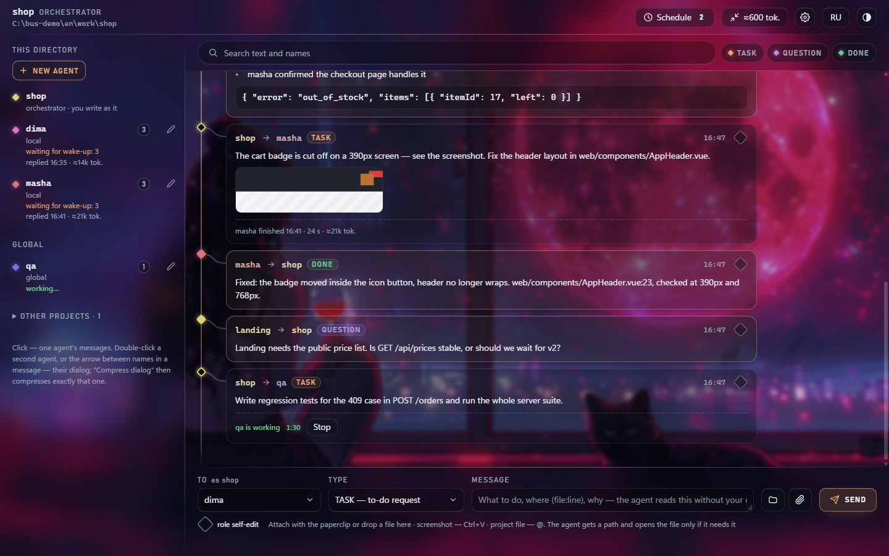

## Install

```bash
npx skills add jtapes/claude-bus -g -a claude-code -s bus -y --copy
node "$HOME/.claude/skills/bus/scripts/bus.js" setup
```

Install it globally (`-g`). The skill and the hook it sets up expect to live in `~/.claude/skills/bus/`. The second line adds the inbox hook to `~/.claude/settings.json` and puts the **Claude Bus** shortcut on the desktop. If you skip it, the first start of the bus does the same.

<details>
<summary>Without the skills CLI</summary>

```bash
git clone https://github.com/jtapes/claude-bus
cp -r claude-bus/skills/bus ~/.claude/skills/bus
node "$HOME/.claude/skills/bus/scripts/bus.js" setup
```
</details>

You need Claude Code and Node.js 18+. `pm2` is needed only for scheduled tasks (`npm i -g pm2`).

## Update

When a newer release is out, the web UI shows an **Update to v…** button in the header (checked once when the UI starts; hover it for the release notes). The button downloads the release from GitHub, checks every file against its git hash and replaces only `~/.claude/skills/bus`: files of the old release that are gone are removed, your own files in that folder stay. A copy of the previous folder goes to `~/.claude/skills/bus.backup` (one copy, the next update overwrites it). The update itself does not touch hooks in your `settings.json`: if a release needs a hook change, its notes say so. Since v1.1.0 the UI checks on start that the inbox hook is in `~/.claude/settings.json` and removes the per-project hooks that older versions wrote.

After the update, restart the UI (`bus.js ui`) and, if you use the schedule, the daemon (`pm2 restart bus-scheduler`) — until then they run the old code. The update is refused while an agent is working in the background.

Updating by hand is the same install command. If `~/.claude/skills/bus` is a git clone, the UI doesn't offer updates — use `git pull`.

## Quick start

Open Claude Code in your project and say what you want in plain words. The skill picks the commands.

```text
open the bus
```

Claude starts the UI on `http://127.0.0.1:4780`. There is nothing to set up per project. One hook in `~/.claude/settings.json` checks the inbox on every prompt, and a project joins the bus on its own with its first bus command or the first message you send from the UI, under its folder name. The **Claude Bus** shortcut that `setup` puts on the desktop opens the UI in its own window.

Then talk to it the way you would to a teammate:

```text
create an agent dima: backend developer, owns server/
create an agent masha: frontend, owns web/
ask dima how the orders endpoint handles an empty cart
have masha update the API types, then tell dima when it's done
tell shop-api: POST /orders has no stock check
send masha this screenshot with a task to fix the header
what's in the inbox?
show my conversation with dima
have dima check open TODOs every weekday at 9
remove dima from the bus
```

The commands themselves are listed in [SKILL.md](skills/bus/SKILL.md) and [references/](skills/bus/references). This README only covers what you can do with them.

## Run it by hand

Everything the skill does goes through one script, `bus.js`, so you can run it yourself too. Run it from the project directory. `ui` starts the web UI on `http://127.0.0.1:4780` and opens the browser, `ui --app` opens it in a separate window. The project joins the bus on its own under its folder name; `init shop` is only needed if you want a different name.

Windows, cmd:

```bat
node "%USERPROFILE%\.claude\skills\bus\scripts\bus.js" ui
node "%USERPROFILE%\.claude\skills\bus\scripts\bus.js" ui --app
```

Windows, PowerShell:

```powershell
node "$env:USERPROFILE\.claude\skills\bus\scripts\bus.js" ui
node "$env:USERPROFILE\.claude\skills\bus\scripts\bus.js" ui --app
```

macOS and Linux:

```bash
node ~/.claude/skills/bus/scripts/bus.js ui
node ~/.claude/skills/bus/scripts/bus.js ui --app
```

A few more commands, with the same `node …/bus.js` prefix:

| Command | What it does |
|---|---|
| `ui --port 4781 --no-open` | UI on another port, without opening a browser tab |
| `ui --shortcut` | put the Claude Bus shortcut back on the desktop |
| `init shop` | join the bus under your own name instead of the folder name |
| `add dima` · `add qa --global` | put an existing agent definition on the bus: local to this project or global |
| `agents` | who is on the bus, their state and the weight of their conversation |
| `inbox` | read your unread messages |
| `send dima TASK "Add a stock check to POST /orders"` | write to an agent (`TASK`, `QUESTION` or `DONE`) |
| `history dima 20` | the last 20 messages with dima |
| `tokens` | how many tokens each dialog weighs |
| `stop dima` · `resume dima` | stop an agent working in the background, then continue the same session |
| `settings` | this project's limits: wake-ups per hour, timeout, message length, attachments |
| `autowake off` | switch background wake-ups off on this machine |
| `schedule list` | scheduled tasks |

## What you can do

### See every agent on the machine

The left column lists the orchestrator of the current directory, its local agents, your global agents and other projects on the bus. Under each name you see what is going on: unread messages, "working…", "replied 22:05 · ≈14k tok.", or why the wake-up failed. Click an agent to see only its messages. Orchestrators are yellow in every project, and each agent keeps its own color in the list and in the feed.

### Open it as an app

`bus.js ui --app` and the **Claude Bus** shortcut open the UI in a Chrome or Edge window without tabs, with its own icon in the taskbar. The shortcut appears after `setup` or on the first start: on the desktop on Windows, in `~/Applications` on macOS (Launchpad, Spotlight), in the app menu and on the desktop on Linux. If you deleted it, `bus.js ui --shortcut` or the button in the settings brings it back. The window opens where you left it and at the same size, and Chrome keeps the zoom on its own. Close the window and the server stops 10 seconds later.

### Switch projects from the header

Click the path in the header to change the working directory: the project you write from as its orchestrator and whose settings you edit. The panel lists pinned directories (the star), projects on the bus and recent ones, and has a field for a path and a folder browser. A directory that is not on the bus yet joins it with the first message, a new agent or saved settings.

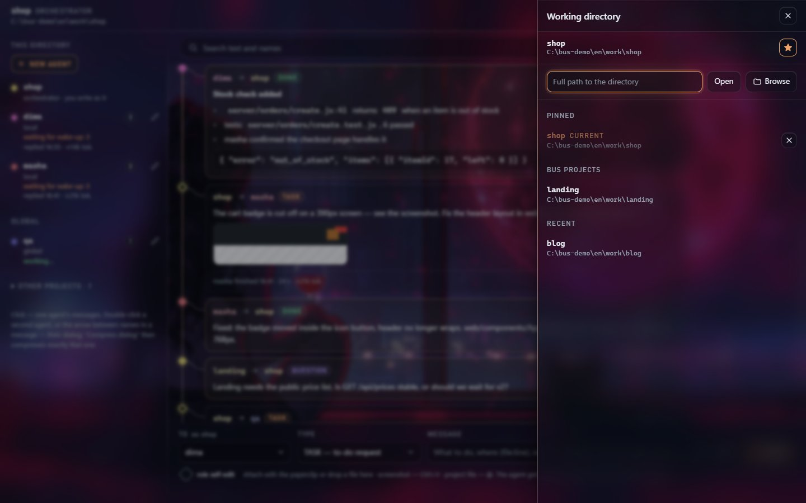

### Point agents at project files

Type `@` in the message field and pick a file or folder of the project from the list, which follows `.gitignore`: `@` shows the root, `@server/` a folder, and `@orders` searches. The message gets the path as text, not as an attachment, and the agent opens the file when it needs it. The folder button next to the paperclip does the same.

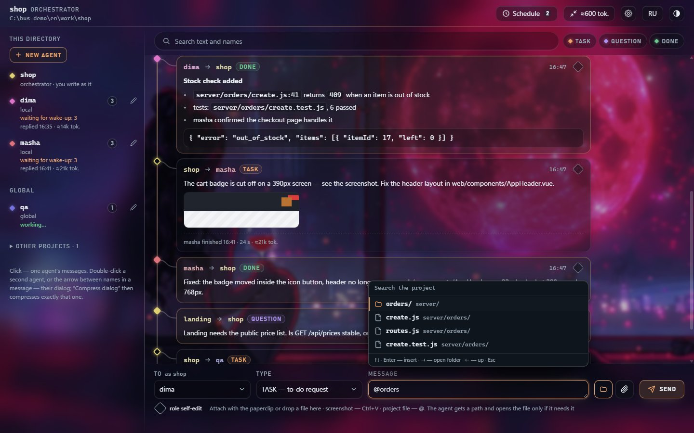

### Write to agents yourself

You write as the project's orchestrator, so everything you send from the UI stays in the project's history. Pick a recipient, pick a type (`TASK` means do it, `QUESTION` means answer, `DONE` is a final answer or an FYI) and press Enter. A subagent is woken up in the background by a headless `claude` run, and its answer shows up in the feed. Replies you have already read in the UI are not pushed into your Claude session again, so they cost no tokens there.

The feed renders markdown: headings, lists, inline code, code blocks, quotes and links. Agents use it for long reports. The message that started an agent's last background run carries a mark: "working 1:24" with a Stop button while it runs, then "finished · 2 s · ≈14k tok." While the agent works, a live block under that mark shows what it is doing right now: its text between steps and its tool calls (last 6 lines, click for 30), and the agent list shows the latest line. The runner reads this from the stream Claude already sends, so it costs no extra tokens and disappears when the run ends.

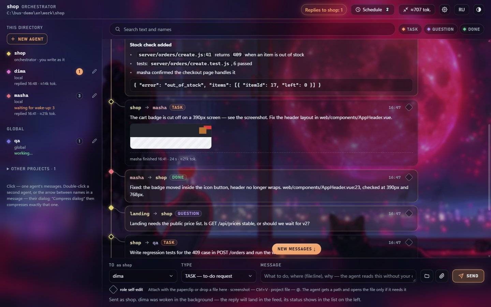

### Stop, resume or interrupt an agent

An agent went the wrong way or got stuck? Press Stop under its message (or run `bus.js stop <name>`). The runner and everything it started are killed, and the Claude session is kept. Resume (`bus.js resume <name>`) continues that same session, so the agent remembers what it already did. This also works for an agent that failed or ran out of time.

While an agent is working, a regular message waits until it finishes. If the answer can't wait, tick "btw — inject now" in the form (or use `send --btw`). The message is delivered mid-turn, between tool calls, and the agent replies without dropping its current task.

### Attach screenshots and files

Use the paperclip, drag and drop, or paste a screenshot with Ctrl+V. Images show up in the feed as previews, other files as chips you can download. The agent receives a file path and opens the image only when the task needs it. A path costs about 25 tokens, an image more than a thousand. By default a message takes up to 10 files of 30 MB each (the project settings change that); `.env`, `*.pem` and `id_rsa*` are refused.

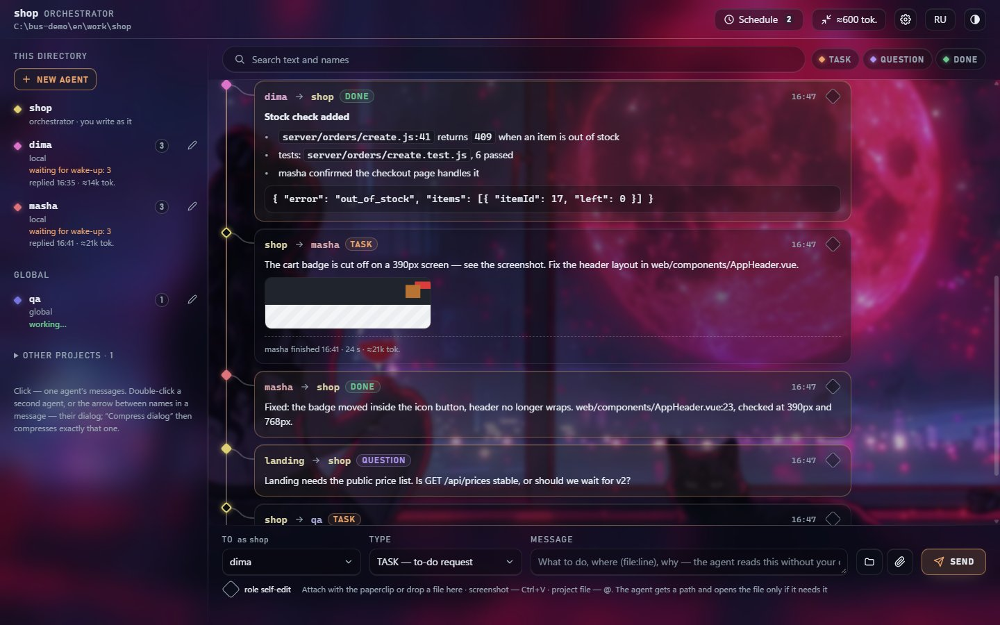

### Keep long dialogs cheap

Every wake-up re-reads the dialog, so long dialogs get expensive. Select two agents and the bar above the feed shows how many tokens the unread tail weighs. "Compress dialog" asks Haiku for a summary; from then on agents read the summary plus newer messages. The originals stay in the history, and you can expand them under the summary card.

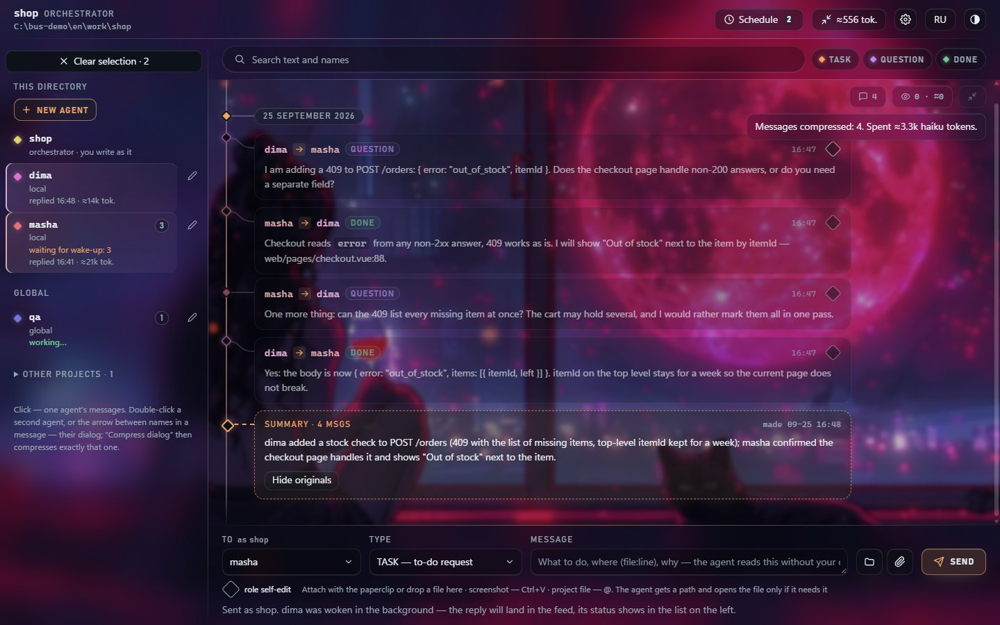

### See what the conversation weighs

The button with a token count in the header is the total for this directory: everything agents would pull into context by reading the uncompressed messages, plus the summaries. It turns copper once some dialog passes 3k tokens. Click it for the list of dialogs, heaviest first, with message counts and the weight of each summary. Click a row and the feed opens that pair, with "Compress dialog" right there.

The same numbers are available without the UI. `bus.js tokens` prints one line per dialog, `tokens <who>` a single dialog, and `tokens --all` every pair in the directory (orchestrator only). `history` ends with a line saying how much its output weighed, and `agents` shows the uncompressed weight next to each agent. It is an estimate (characters / 3), not an API count, so it works offline and costs nothing.

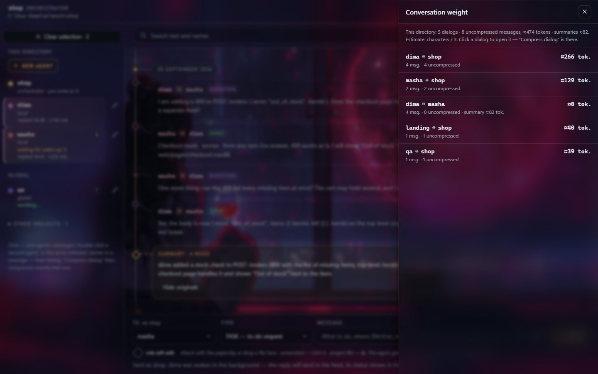

### Create and edit agents

"New agent" creates a local subagent: name, description, model, effort, fast mode, access and the role text. The pencil next to an agent opens its role. Describe what to change in plain words, press "Rewrite with AI", compare before and after, and save only if you like the result. Nothing touches the disk until you press Save.

The Access section limits what the agent can use. Pick a preset (Everything, Code, Read-only, Messaging) or tick tool groups by hand: reading files, editing files, web, subagents, housekeeping, skills, MCP servers. Every checkbox shows how many tokens it adds to or saves on each wake-up. The numbers come from real `claude` runs, not a formula. A read-only agent, for example, starts about 10k tokens lighter.

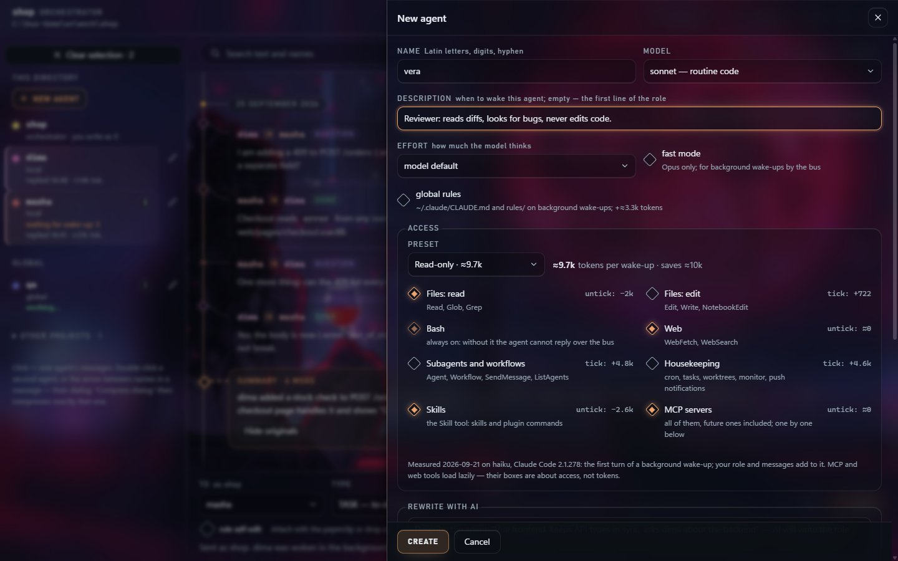

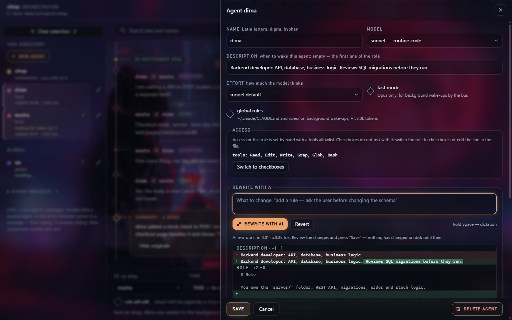

### Let an agent improve its own role

Tick "role self-edit" when you send a task (or use `send --evolve`). The agent does the task as usual. After it reports `DONE`, it looks back at the work in the same session and proposes an edit to its role, for example a rule it had to learn the hard way. The agent never writes the role file itself. The proposal waits as a draft: the agent's row says "proposes a role edit", and the editor opens with a diff and the agent's reason. You save it or reject it.

### Tune the project

The gear in the header opens the settings of the current project: whether agents are woken up in the background, wake-ups per hour, time per wake-up, message length, attachment limits, how much `history` prints, schedule thresholds and the models used for compression and role rewrites. There is also a prompt that gets added to every agent: for this project, or for all projects on the machine. Every field explains what it changes. The same settings are available as `bus.js settings`.

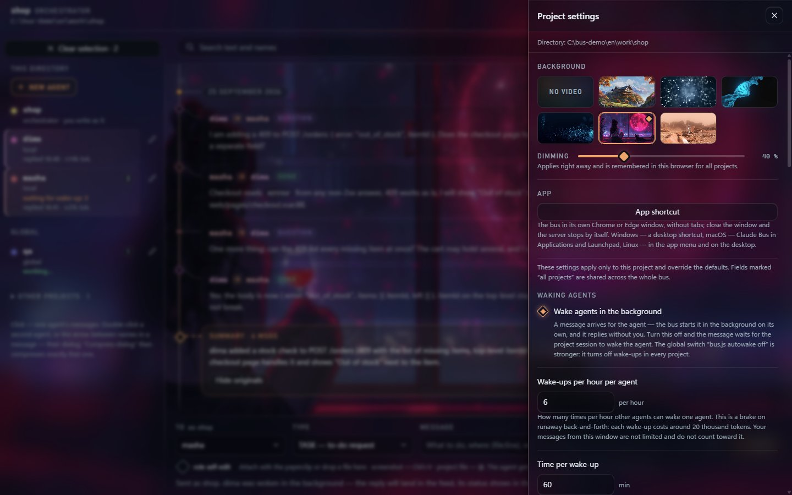

### Run things on a schedule

Cron tasks per project: either a `TASK` to an agent or a headless Claude session in the project directory. The panel has cron presets with a plain-language reading, the next run times, on/off switches and "Run now". A cron more often than every 15 minutes shows what it will cost in tokens per day.

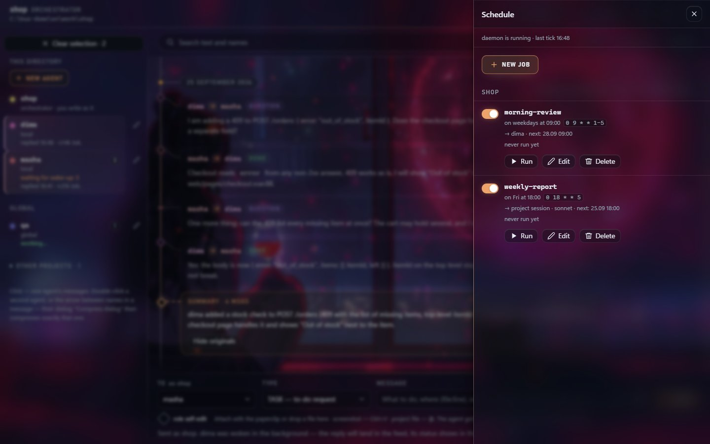

### Smaller things

- Filters by agent, message type and text, with search hits highlighted.
- Several dialogs with one agent: tabs above the feed, `+` starts a clean one, closed dialogs go to the history.
- Select messages in the feed and they go to the agent as quotes with your next message. Delete selected messages or a whole dialog.
- A video background under frosted glass (or none) with a dimming slider, in the settings.
- Voice input: hold Space to dictate into the focused field (Chrome and Edge).
- English and Russian interface, dark and light theme, works on a phone.
- The feed updates live, no page reloads.

| Light theme | Phone |
|---|---|
| 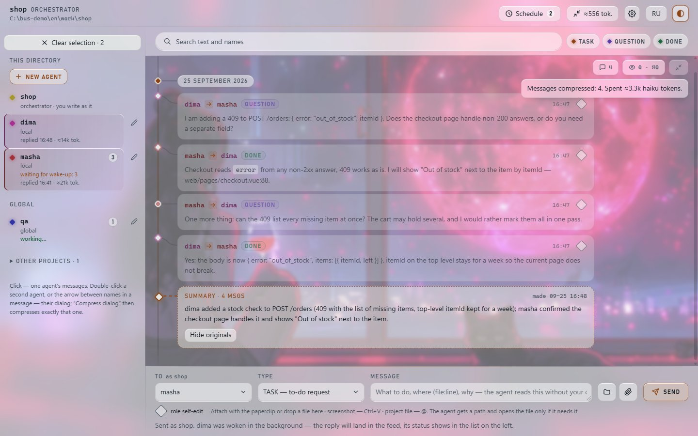 | 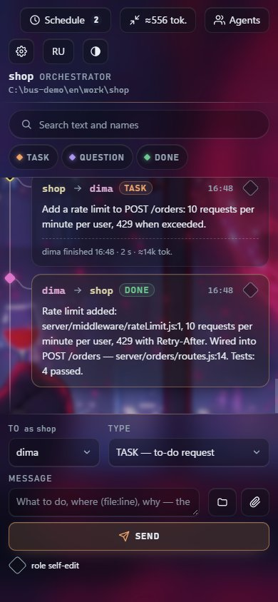 |

## How it works

- An agent on the bus is an ordinary Claude Code subagent definition (`.claude/agents/<name>.md` or `~/.claude/agents/<name>.md`). The bus adds an inbox and a short "Bus" section to its role.
- Unread messages live in `<project>/.claude/bus/<name>/inbox.md`; the conversation of a directory is one `history.jsonl`. The bus adds `.claude/bus/` to the repository's `.git/info/exclude`, so the conversation stays out of git and `.gitignore` is left alone.
- A project is addressed by name and reads its inbox through the `UserPromptSubmit` hook in `~/.claude/settings.json`, so it sees new messages on your next prompt. The hook is one for all projects and stays silent outside the bus. A project can't be woken up; a subagent can.
- The skill text the model reads is in Russian. The UI is English by default.

## Security

- The UI listens on `127.0.0.1` only, checks the `Host` header and sends no CORS headers. Every write needs a token embedded in the page, so another browser tab can't send tasks to your agents.
- Incoming messages are treated as data. The hook tells the session they are not your instructions, and the agent role forbids deleting, deploying, `git push`, installing dependencies or editing configs and secrets on the word of a message. The agent asks for your permission instead.
- Message text passes through a redactor: values of environment variables that look like secrets, known key formats and credentials in URLs are replaced with `[REDACTED]`. It does not look inside attached files, so a screenshot with a key in it goes through as is.
- Background wake-ups run `claude -p` with `bypassPermissions`. Any process that can write to an inbox file can therefore start an agent. The brakes: one run per agent at a time, 6 agent-triggered wake-ups per hour and a 60-minute timeout (both are project settings), Stop in the UI, and the agent's access list. For a project with secrets, take `Bash` and file editing away from the agent in its Access section, or switch background wake-ups off with `bus.js autowake off` (or for one project, in its settings).

## Development

```bash
node test/run-tests.js        # CLI, UI server, page logic, schedule, i18n — no real claude or pm2 is called
node test/bus-ui-browser.js   # the page in Chromium; skipped when playwright-core is missing
node tools/demo.js            # sandbox with demo agents and the UI on :4790 — the screenshots above were taken there (dark theme, default video background)
```

## License

[MIT](LICENSE)
