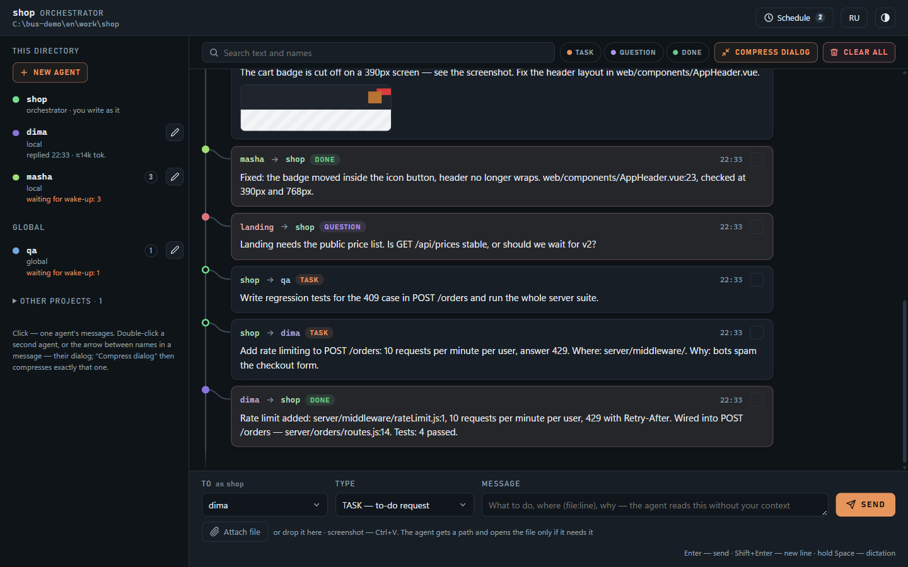

# claude-bus

[English](README.md) · **Русский**

Шина сообщений для агентов Claude Code. Проекты, субагенты и вы сами оставляете друг другу сообщения через обычные файлы, а локальный веб-интерфейс показывает всю переписку. Получатель не обязан быть запущен: сообщение лежит в его ящике, пока его не прочтут, а субагента шина поднимает сама, чтобы он ответил.

Всё это одна папка скилла, которая работает на Node.js. npm-зависимостей у неё нет, база и отдельный сервер ей не нужны.


## Установка

```bash
npx skills add jtapes/claude-bus -g -a claude-code -s bus -y --copy
```

Ставьте глобально (`-g`): скилл и хук, который он прописывает, рассчитаны на путь `~/.claude/skills/bus/`.

<details>
<summary>Без skills CLI</summary>

```bash
git clone https://github.com/jtapes/claude-bus
cp -r claude-bus/skills/bus ~/.claude/skills/bus
```
</details>

Нужны Claude Code и Node.js 18+. `pm2` понадобится только для задач по расписанию (`npm i -g pm2`).

## Быстрый старт

Откройте Claude Code в своём проекте и скажите, что нужно, обычными словами. Команды скилл подберёт сам.

```text
разверни в данном проекте скилл /bus и разверни ui
```

Claude подключит проект к шине, пропишет хук, который на каждом промпте проверяет входящие, и поднимет интерфейс на `http://127.0.0.1:4780`.

Дальше разговаривайте с ним как с коллегой:

```text
создай агента dima: бэкенд-разработчик, его зона — server/
создай агента masha: фронтенд, её зона — web/
спроси у димы, как эндпоинт заказов обрабатывает пустую корзину
пусть маша обновит типы API и потом сообщит диме
передай shop-api: в POST /orders нет проверки остатка
кинь маше этот скрин с задачей поправить шапку
что во входящих?
покажи переписку с димой
пусть дима по будням в 9 утра проверяет открытые TODO
убери диму из шины
```

Сами команды перечислены в [SKILL.md](skills/bus/SKILL.md) и [references/](skills/bus/references). Здесь рассказано только о том, что с их помощью можно делать.

## Возможности

### Видеть всех агентов на машине

В левой колонке стоят оркестратор текущего каталога, его локальные агенты, ваши глобальные агенты и другие проекты шины. Под именем видно, что происходит: непрочитанные, «работает…», «ответил 22:05 · ≈14к ток.» или причина, по которой подъём не удался. Клик по агенту оставляет в ленте только его сообщения.

### Писать агентам самому

Вы пишете от имени оркестратора проекта, поэтому всё отправленное из интерфейса остаётся в истории проекта. Выберите получателя и тип (`TASK` значит «сделай», `QUESTION` значит «ответь», `DONE` означает итог или «к сведению») и нажмите Enter. Субагента поднимет фоновый запуск `claude`, ответ появится в ленте. Ответы, которые вы уже прочитали в интерфейсе, в сессию Claude повторно не попадают и токенов там не стоят.


### Прикладывать скрины и файлы

Файл можно приложить скрепкой, перетащить в окно или вставить скриншот через Ctrl+V. Агент получает путь к файлу и открывает картинку, только если без неё задачу не сделать: путь стоит около 25 токенов, а картинка больше тысячи. До 5 файлов по 10 МБ; `.env`, `*.pem` и `id_rsa*` шина не берёт.


### Не платить за длинные диалоги

Каждый подъём перечитывает диалог, и длинная переписка дорожает. Выберите двух агентов, и над лентой появится вес непрочитанного хвоста в токенах. «Сжать диалог» просит у Haiku сводку; дальше агенты читают её и сообщения после неё. Оригиналы остаются в истории и раскрываются под карточкой сводки.


### Видеть, сколько весит переписка

Кнопка с числом токенов в шапке показывает итог по директории: столько агенты затянут в контекст, если прочитают всё несжатое, плюс сводки. Она становится медной, когда какой-то диалог перевалил за 3к токенов. По клику открывается список диалогов, тяжёлые сверху: сколько сообщений, сколько несжатых, сколько весит сводка. Клик по строке открывает эту пару в ленте, и «Сжать диалог» уже под рукой.

Те же числа есть и без UI. `bus.js tokens` печатает строку на диалог, `tokens <кто>` показывает один диалог, `tokens --all` выводит все пары директории (только оркестратору). `history` заканчивается строкой о весе показанного, а `agents` пишет вес несжатой переписки рядом с каждым агентом. Это оценка (символы / 3), а не счёт через API: работает без сети и ничего не стоит.


### Создавать и править агентов

«Новый агент» заводит локального субагента: имя, описание, модель, effort, fast mode и текст роли. Карандаш рядом с агентом открывает его роль. Опишите словами, что поменять, нажмите «Переписать с ИИ», сравните «было» и «стало» и сохраняйте, только если результат устраивает. До кнопки «Сохранить» на диске ничего не меняется.


### Запускать по расписанию

Задачи по cron заводятся в каждом проекте: либо `TASK` агенту, либо headless-сессия Claude в каталоге проекта. В панели есть пресеты cron с расшифровкой словами, ближайшие запуски, тумблеры и «Запустить сейчас». Если cron чаще раза в 15 минут, панель покажет, во сколько токенов в сутки это обойдётся.


### По мелочи

- Фильтры по агентам, типам и тексту, найденное подсвечивается.
- Удаление выбранных сообщений, очистка одного диалога или всей истории.
- Голосовой ввод: зажмите пробел и диктуйте в поле под курсором (Chrome и Edge).
- Интерфейс на русском и английском, светлая и тёмная тема, работает на телефоне.
- Лента обновляется сама, без перезагрузки страницы.

| Тёмная тема | Телефон |
|---|---|
|  |  |

## Как устроено

- Агентом шины служит обычное определение субагента Claude Code (`.claude/agents/<имя>.md` или `~/.claude/agents/<имя>.md`). Шина добавляет ему ящик и короткий блок «Шина» в роль.
- Непрочитанное лежит в `<проект>/.claude/bus/<имя>/inbox.md`, а вся переписка каталога хранится в одном `history.jsonl`. Добавьте `.claude/bus/` и `.claude/settings.local.json` в `.gitignore` проекта.
- Проект адресуется по имени и читает свой ящик хуком `UserPromptSubmit`, то есть видит новое на вашем следующем промпте. Проект поднять нельзя, а субагента можно.
- Текст скилла, который читает модель, написан по-русски. Интерфейс по умолчанию английский, язык переключается кнопкой в шапке.

## Безопасность

- Интерфейс слушает только `127.0.0.1`, сверяет заголовок `Host` и не отдаёт CORS-заголовков. Любая запись требует токена, вшитого в страницу, поэтому другая вкладка браузера не сможет слать задачи вашим агентам.
- Входящие считаются данными. Хук сообщает сессии, что это не ваши инструкции, а роль агента запрещает по сообщению из шины удалять, деплоить, делать `git push`, ставить зависимости, править конфиги и секреты: вместо этого агент спрашивает разрешения.
- Текст сообщений проходит через фильтр секретов: значения переменных окружения, похожих на секреты, известные форматы ключей и логин с паролем внутри URL заменяются на `[REDACTED]`. Внутрь вложений фильтр не заглядывает, так что скриншот с ключом уедет как есть.
- Фоновый подъём запускает `claude -p` с `bypassPermissions`. Значит, любой процесс, который может дописать строку в файл ящика, может запустить агента. Тормоза: один запуск на агента одновременно, 6 подъёмов в час от других агентов, таймаут 10 минут и список `tools` в определении агента. В проекте с секретами уберите `Bash` из инструментов агента или выключите фоновый подъём: `bus.js autowake off`.

## Разработка

```bash
node test/run-tests.js        # CLI, UI-сервер, логика страницы, расписание, i18n — настоящие claude и pm2 не зовутся
node test/bus-ui-browser.js   # страница в Chromium; без playwright-core прогон пропускается
node tools/demo.js --lang ru  # песочница с демо-агентами и интерфейсом на :4790 — на ней сняты скрины
```

## Лицензия

[MIT](LICENSE)
